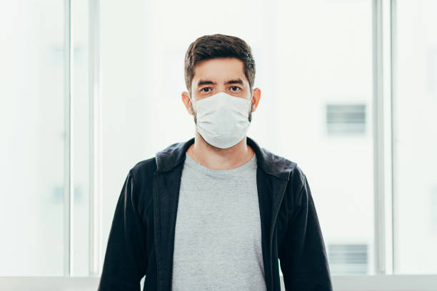
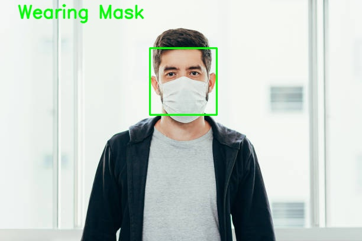
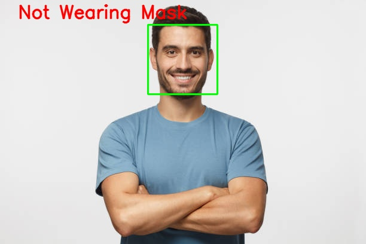

# SIMPLE FACE MASK DETECTION API

This is API for Detecting Face Mask using Haarcascade Face and Mouth on OpenCV.

## Tutorial

Clone the project

```bash
  git clone https://github.com/isa96/simple-face-mask-detection.git
```

Go to the project directory

```bash
  cd SimpleFaceMaskDetection
```

Create and start API service

```bash
  docker-compose up
```

Stop and remove API service

```bash
  docker-compose down
```

  
## API Reference

Service: http://your-ip-address:8080

#### POST image

```http
  POST /predict
```
Content-Type: multipart/form-data
| Name    | Type   | Description                                         |
| :------ | :----- | :-------------------------------------------------- |
| `image` | `file` | **Required**. `image/jpeg` or `image/png` MIME Type |


## Result Example

**Input:**<br>


**Output:**<br>


---

**Input:**<br>


**Output:**<br>
 
  

  
